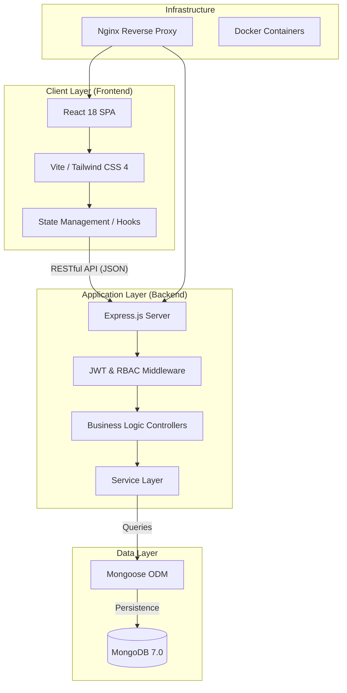
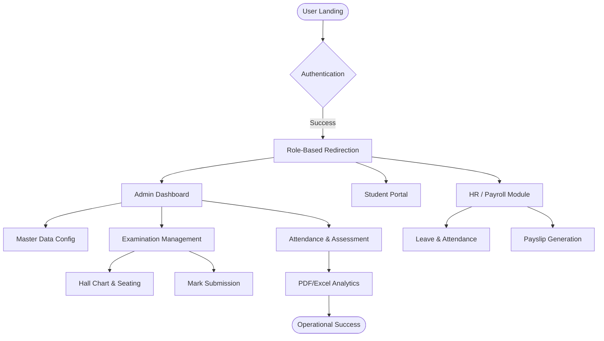
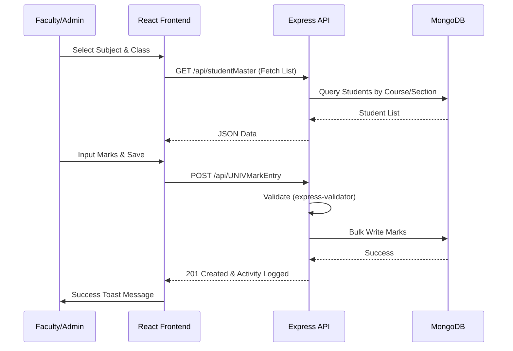
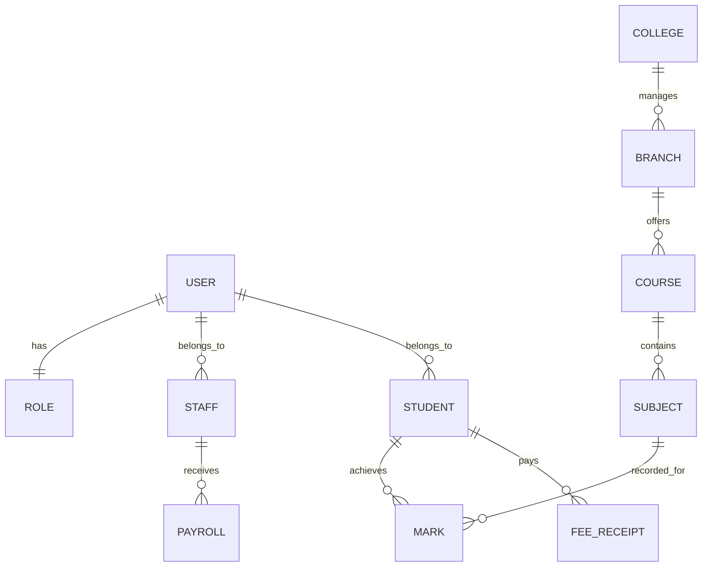
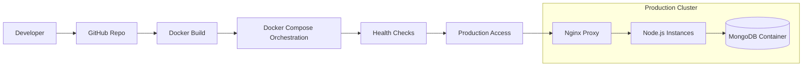

# 🚀 SF-ERP | Enterprise Education Management System

[](https://github.com/prawinkumar2k/cmspbl)
[](https://github.com/prawinkumar2k/cmspbl)
[](https://github.com/prawinkumar2k/cmspbl/blob/main/LICENSE)
[](https://github.com/prawinkumar2k/cmspbl)
[](https://github.com/prawinkumar2k/cmspbl/graphs/commit-activity)

---

## 📖 Overview

**SF-ERP** is a world-class, industrial-grade Enterprise Resource Planning (ERP) system specifically engineered for modern educational institutions (Colleges, Universities, and Schools). 

In today's complex academic environment, managing fragmented data across departments—admissions, academics, finance, and human resources—is a significant bottleneck. SF-ERP provides a **unified, high-performance platform** that digitizes the entire institutional lifecycle. From the moment a lead is captured in the admission funnel to the generation of a student's final degree and the processing of staff payroll, SF-ERP ensures data integrity, operational efficiency, and real-time visibility.

### 🌟 Why SF-ERP?
- **Centralized Command**: One single source of truth for all institutional data.
- **Scalable Architecture**: Built using a containerized MERN stack, ready for cloud deployment.
- **Role-Centric Design**: Tailored dashboards for Administrators, Faculty, HR, and Students.
- **Institutional Depth**: Covers niche requirements like Hall Chart generation, Digital Numbering, and Transport Maintenance.

---

## 🧠 System Architecture

### 📊 Architecture Diagram



### 🏗️ Architecture Explanation
- **Frontend**: A high-speed Single Page Application (SPA) built with React 18 and Vite. It utilizes **Tailwind CSS 4** for styling and **TanStack Table** for heavy data management.
- **Backend**: A robust Node.js/Express server following an industrial-standard controller-service-route pattern. It implements **Request ID tracing**, **Structured Logging**, and **Graceful Shutdown** for high availability.
- **Data Persistence**: MongoDB serves as the primary document store, offering flexibility for complex institutional schemas like examination marks and dynamic fee structures.
- **Security**: The system is hardened with **Helmet.js**, strict **CORS policies**, and **JWT-based Authentication** with refresh token logic.

---

## 🔄 Application Flow

### 📌 General Workflow



---

## 🔁 Sequence Diagram: Examination Mark Entry



---

## 🧩 Module Breakdown

### 👑 Admin & Master Control
- **Configuration**: Setup Branches, Subjects, Academic Years, Regulations, and Semesters.
- **User Management**: Create and manage staff accounts with granular role permissions.
- **Global Settings**: Manage the Academic Calendar and Institution Metadata.

### 📚 Academic Module
- **Attendance**: Daily, Spell-based, and Marked attendance with real-time reports.
- **Assessments**: Configure Unit Tests, Assignments, and Practical exams.
- **Timetable**: Dynamic Class Timetable generation and period allocation.

### 📝 Examination System
- **Pre-Exam**: Hall Details, QP Requirement, Nominal Roll generation, and Exam Fees.
- **Process**: Hall Chart generation, Seat Allocation, and Digital Numbering.
- **Results**: Mark entry for Theory and Practical, Arrear tracking, and Consolidated Reports.

### 🤝 Admission & Enquiry
- **Lead Pipeline**: Lead Management, Caller Details, and Enquiry Dashboards.
- **Admission**: Application Issuance, Quota Allocation, and Admitting Students.
- **Certificates**: Automated generation of TC, Bonafide, Conduct, and Course Completion certificates.

### 💼 HR & Payroll
- **Employee Lifecycle**: Staff Profiles, Document Vault, and Designation History.
- **Leave Management**: Application, Approval workflow, and Leave Balance analysis.
- **Payroll**: Salary Structure Config, Monthly Processing, and Automated Payslip (PDF) generation.

### 💰 Finance & Office
- **Fees**: Fee Collection, Receipt generation, and Ledger tracking.
- **Accounts**: Income/Expense entry, Cash Book management, and Settlement tracking.
- **Inventory**: Stock Entry, Purchase orders, and Asset management.

---

## ✨ Features

- **📊 Real-time Analytics**: Interactive dashboards using **ApexCharts** and **Recharts**.
- **🔒 Secure RBAC**: Strict Protected Routes and role-based component rendering.
- **📄 Document Automation**: One-click generation of PDF Reports, Payslips, and Certificates.
- **🚌 Transport Management**: Vehicle maintenance tracking, Student bus fee, and route reports.
- **📦 Inventory & Assets**: Comprehensive tracking of institutional assets and consumables.
- **🏗️ Dockerized**: Ready for production with a multi-container Docker Compose setup.
- **📱 Responsive Design**: Fully responsive UI built for Desktops, Tablets, and Mobile devices.

---

## 🧰 Tech Stack

### 🎨 Frontend
- **React 18 & Vite**: Core library and lightning-fast build tool.
- **Tailwind CSS 4**: Modern utility-first CSS for premium design.
- **TanStack Table**: High-performance data grids for managing thousands of records.
- **FullCalendar**: Comprehensive academic scheduling.
- **Axios**: Promised-based HTTP client with interceptors for auth.

### ⚙️ Backend
- **Node.js & Express 5.x**: Scalable server-side logic.
- **Mongoose**: Elegant MongoDB object modeling.
- **JWT (JsonWebToken)**: Secure stateless authentication.
- **Bcrypt.js**: Industry-standard password hashing.
- **Helmet & CORS**: Backend hardening and cross-origin security.

### 🗄️ Database & DevOps
- **MongoDB 7**: Document-oriented NoSQL database.
- **Docker & Docker Compose**: Containerization for environment consistency.
- **Nginx**: Reverse proxy and static file delivery for production.

---

## 📂 Project Structure

```text
SF-ERP/
├── client/                 # React Frontend
│   ├── src/
│   │   ├── components/     # Reusable UI (Buttons, Tables, Sidebar)
│   │   ├── pages/          # Modularized Dashboards (Admin, HR, Student)
│   │   ├── context/        # Auth and Global State providers
│   │   └── App.jsx         # Navigation and Route Definitions
│   └── Dockerfile          # Frontend build container
├── server/                 # Express Backend
│   ├── models/             # 50+ Mongoose schemas (Student, Exam, Payroll...)
│   ├── routes/             # API Endpoints organized by module
│   ├── controller/         # Business logic implementation
│   ├── middlewares/        # Auth, Error, and Security middlewares
│   ├── lib/                # Database and Logger utilities
│   └── app.js              # Production server entry point
├── docker-compose.yml      # Orchestration for Mongo, Client, and Server
└── README.md
```

---

## ⚙️ Installation & Setup

### 🛠️ Prerequisites
- Node.js (v20+)
- MongoDB (Running locally or via Docker)
- Docker Desktop (Optional but Recommended)

### 🏃 Local Development

1. **Clone the Repository**
   ```bash
   git clone https://github.com/prawinkumar2k/cmspbl.git
   cd cmspbl
   ```

2. **Setup Backend**
   ```bash
   cd server
   npm install
   # Create .env file with MONGO_URI, JWT_SECRET, PORT
   npm run dev
   ```

3. **Setup Frontend**
   ```bash
   cd ../client
   npm install
   # Update VITE_API_URL in .env
   npm run dev
   ```

### 🐳 Docker Deployment (Production)
```bash
docker-compose up --build -d
```
The application will be available at `http://localhost:3000` (or your configured `CLIENT_PORT`).

---

## 🔐 Security & Restrictions

- **JWT Authentication**: Secured stateless sessions.
- **Granular Authorization**: Only specific roles (e.g., `Admin`, `HR`) can access payroll or user management.
- **Rate Limiting**: Brute-force protection on `/api/login` and general rate limits for API usage.
- **Helmet.js**: Protection against XSS, Clickjacking, and other common web vulnerabilities.
- **Sanitization**: Request bodies are validated using `express-validator`.

---

## 🗄️ Database Design

### 📊 ER Diagram (Simplified)



---

## 🚀 DevOps & Deployment

### ⚙️ Deployment Pipeline



- **Containerization**: Separate containers for DB, API, and Frontend ensure isolation.
- **Health Checks**: Automated monitoring ensures containers restart if services fail.
- **Scaling**: Nginx is configured to serve static assets and proxy traffic to the backend clusters.

---

## 🔮 Future Enhancements

- **🤖 AI Analytics**: Predict student performance and dropout rates using Machine Learning.
- **📱 Native Mobile App**: React Native integration for real-time push notifications.
- **💬 Integrated Chat**: In-app communication between faculty and students.
- **💳 Payment Gateway**: Integration with Stripe/Razorpay for online fee payments.

---

## 🤝 Contribution Guide

1. **Fork** the repository.
2. Create a **Feature Branch** (`git checkout -b feature/AmazingFeature`).
3. **Commit** your changes (`git commit -m 'Add some AmazingFeature'`).
4. **Push** to the branch (`git push origin feature/AmazingFeature`).
5. Open a **Pull Request**.

---

## 📜 License

Distributed under the **ISC License**. See `LICENSE` for more information.

---

<p align="center">
  Built with ❤️ by the <b>SF-ERP Development Team</b>
</p>
